# Shortcuts

- B007 > Shortcut to B023, one tile east to the exit.

- B037 > Shortcut to B053, one tile above the chest.

- B083 > Shortcut to B109. Interact with the loner chest to the left four times.

- B131 > Shortcut to B167. Break all glass tiles before falling. (Untested by myself.)

- B163 > Shortcut to B197. Remove stairs and fall on it's empty tile. 

# Domain List: 

## B001-B028 
### Lord ??? Domain - ??? Lord  
  
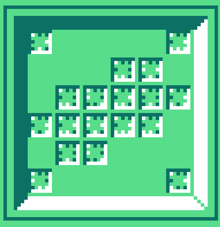  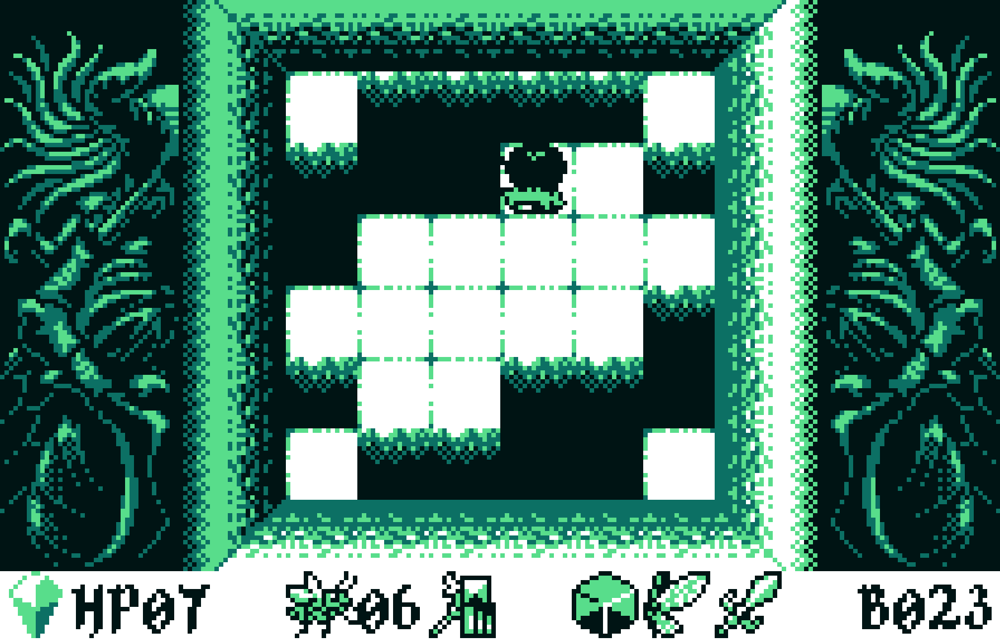 

  - Brand ??? - 
    - Translation: ONLY MEMORY REMAINS
    - Get: Memory cube item
    - Hit chest 6 seconds and wait 6 seconds to leave
    - Exit goes to B025

## B029-B056 
### Lord Bee's Domain - Smiling Lord  
  - devoted to Lord Add 

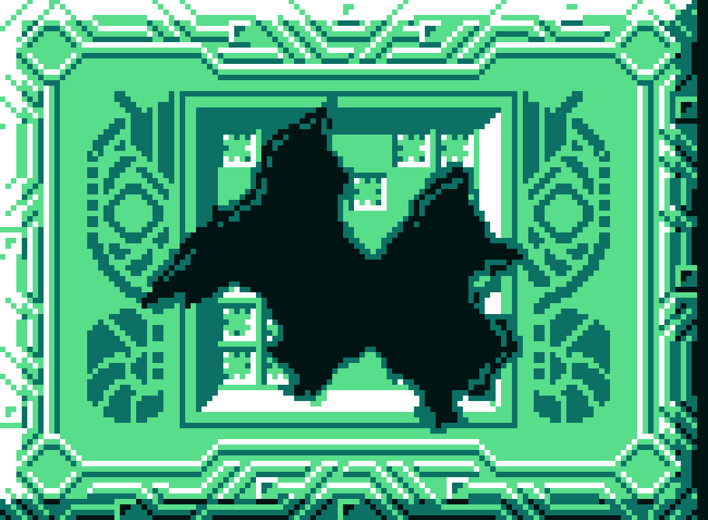  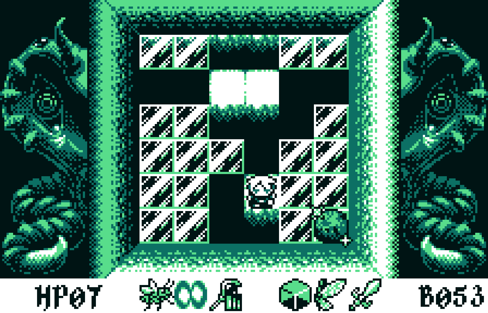   
  - Bee's brand 
    - Translation: Mioens
    - Actual Translation: ONLY .I..E...... REMAINS
    - Has a broken seal
    - Exit goes to B055
- Tail resides here  

## B057-B084 
### Lord Mon's Domain - Covetous Lord

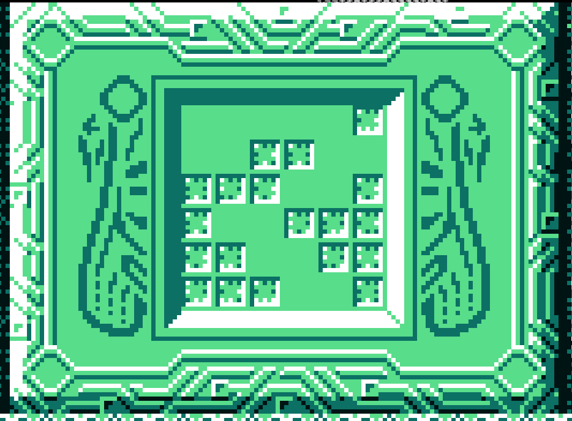  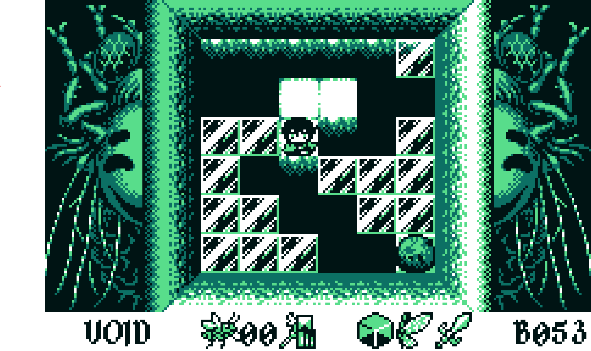

  - Mon's Brand
    - Get: wings 
    - Exit goes to B071

## B085-B112 
### Lord Tan's Domain - Shunned Lord

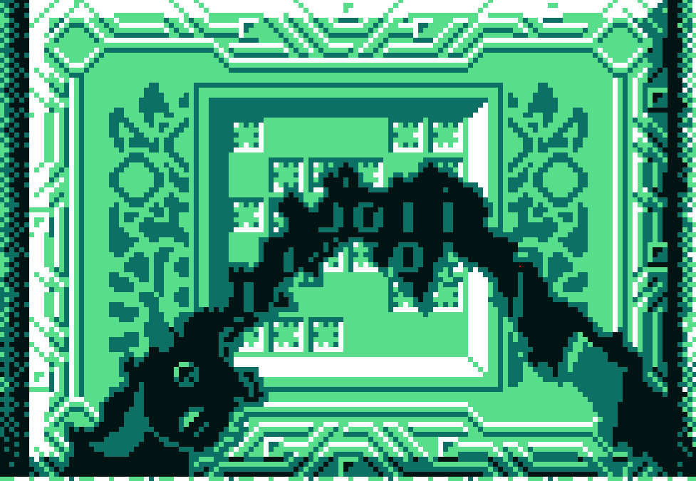  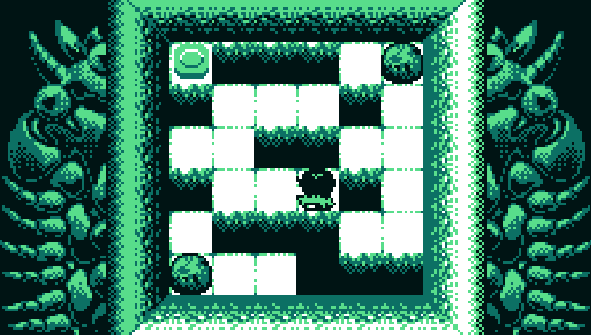

- Tan's Brand
- wall hint + used to be a seal - ends in B111

## B113-B140 
### Lord ??? Domain - Feeble/Indecisive Lord 
- Didn't choose a side when the war happend

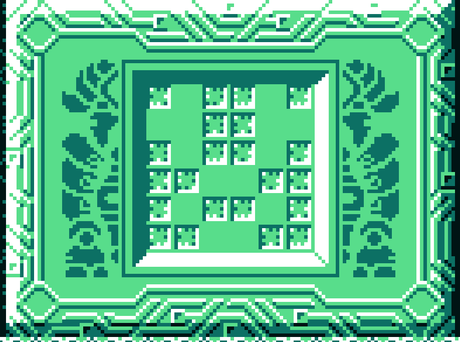  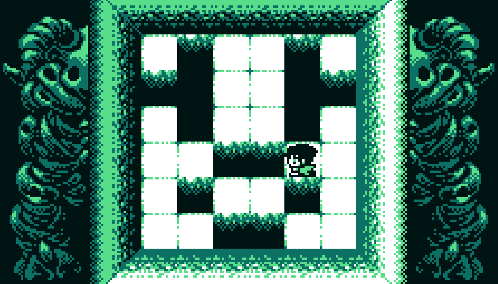
- ??? brand 
  - Get: sword 
  - Exit goes to B140

- Gor resides here

## B141-B168 
### Lord ???

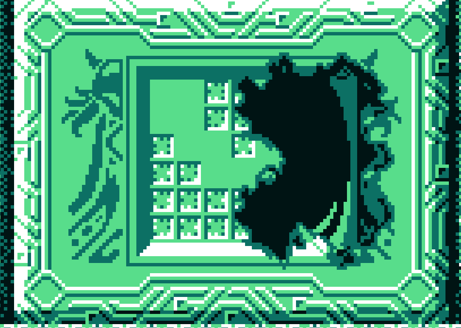 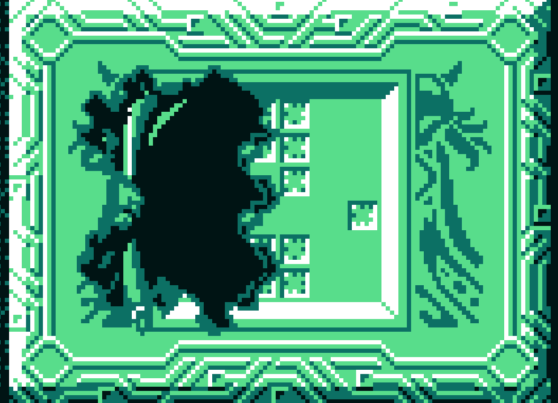  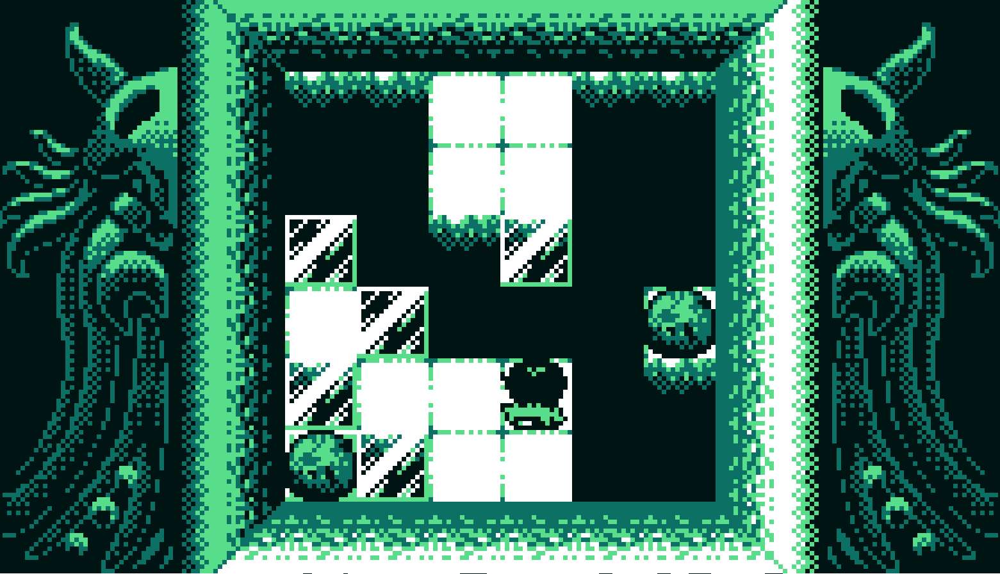

 - ??? brand
   - weird statue
   - broken seal 
   - Exit goes to B162

## B169-B196 
### Lord Lev's Domain - Devious Lord
  - Killed himself after his sister died

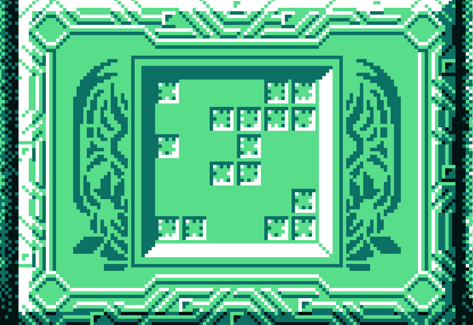  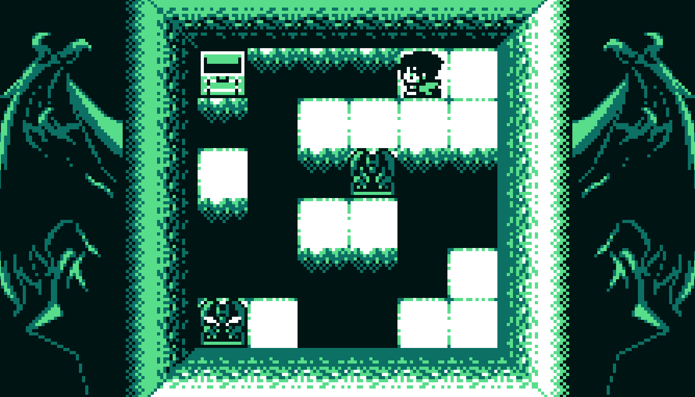

  - Lev's Brand 
    - Forced open chest
    - Wall hint 
    - Exit goes to B162

## B197-B224 
### Lord Cif's Domain

(no mural picture because it's blocked) 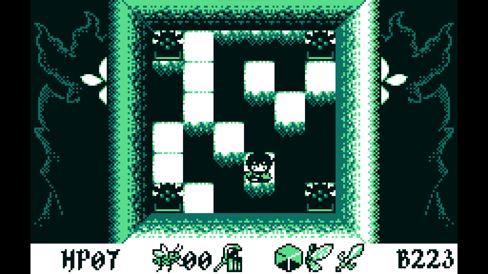 

  - Cif's brand
    - hint for upgraded staff 
    - Exit goes to B224

## B224 - B225 
### Lord Add's Domain

# Picross

Found on shortcut B037  
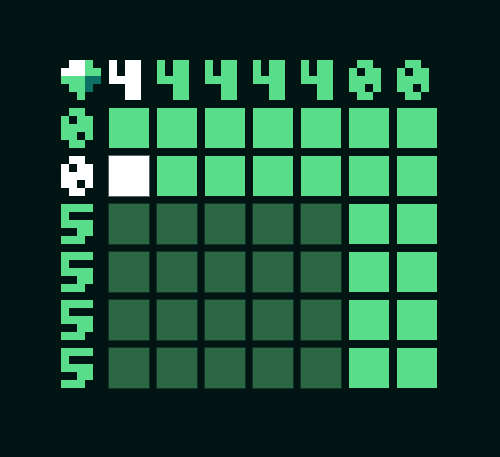